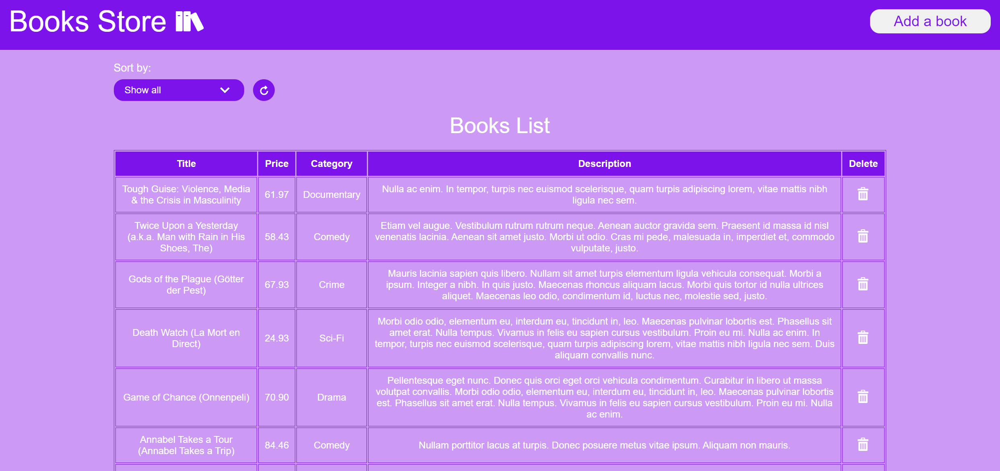

 <h1>Books Store</h1>

<h2>A single page Books store website.</h2>

 <h1>About project</h1>
</h2>
<h3>Done:</h3>
<ul><li>List of the books; </li>
<li>Possibility to add, edit and delete book;</li>
<li>Universal modal window;</li>
<li>Work with react-hook-form and yup.</li>
</ul>
 <h1>Used technologies</h1>
 

 &nbsp;
  &nbsp;
  &nbsp;
  &nbsp;
        &nbsp;
        &nbsp;
         &nbsp;
  

